# RAG Engineering Platform (rag-insight) 아키텍처 설계서

**삼성전자 CS센터 챗봇 시스템 — 운영 품질 개선 플랫폼**
Draft v2.0 · 2026-06-14

---

## 목차

1. [개요](#1-개요)
2. [비즈니스 아키텍처](#2-비즈니스-아키텍처)
3. [시스템 구성도](#3-시스템-구성도)
4. [구성 요소 상세](#4-구성-요소-상세)
5. [처리 흐름도](#5-처리-흐름도)
6. [데이터 아키텍처](#6-데이터-아키텍처)
7. [평가 아키텍처](#7-평가-아키텍처)
8. [개선 아키텍처](#8-개선-아키텍처)
9. [시뮬레이션 아키텍처](#9-시뮬레이션-아키텍처)
10. [배포 아키텍처](#10-배포-아키텍처)
11. [모니터링 아키텍처](#11-모니터링-아키텍처)
12. [품질 관리 체계](#12-품질-관리-체계)
13. [기술 스택](#13-기술-스택)
14. [향후 확장 전략](#14-향후-확장-전략)

---

## 1. 개요

### 1.1 목적

본 문서는 **삼성전자 CS센터 챗봇 시스템**(이하 RAG 챗봇)의 운영 품질을 지속적으로 개선하기 위한 End-to-End RAG Engineering Platform, **rag-insight**의 아키텍처를 정의한다. rag-insight는 운영 trace·NPS·VOC를 분석하여 원인을 진단하고, 개선안을 도출·검증한 뒤 배포 승인까지 수행하는 **닫힌 피드백 루프(closed loop)**를 제공한다.

### 1.2 배경 및 문제 정의

RAG 챗봇은 의도분류 → 제품코드 추출 → Query Rewrite → CRAG Retrieval → Rerank → Context 선택 → 답변 생성으로 구성된 다단계 파이프라인이다.

현재 이 파이프라인의 운영 로그는 **과거분(historical)과 실시간분(real-time)이 모두 오브젝트 스토리지에 구조화된 형태로 통합 수집·조회되고 있다.** 즉 RAG 파이프라인 전 단계(이해 → 검색 → rerank → context → 생성)의 trace 데이터 자체는 이미 확보되어 있으며, 별도의 수집·정규화 인프라를 신규로 구축할 필요가 없다.

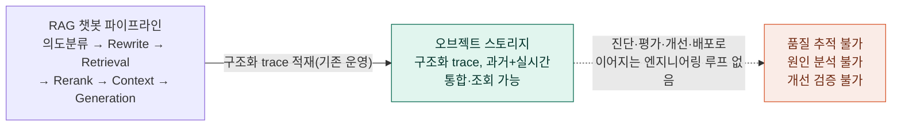

문제는 데이터의 존재 여부가 아니라, **그 데이터를 활용하는 엔지니어링 루프의 부재**이다.

1. trace는 있으나, 이를 RCA 택소노미로 분류·집계하는 진단 체계가 없어 품질 저하(낮은 NPS, 환각, 검색 실패 등)의 원인을 신속히 특정하기 어렵다.
2. 개선(프롬프트 수정, 검색 파라미터 튜닝 등)의 효과를 객관적으로 검증할 골든셋·통계적 게이트가 없어, 변경이 회귀를 유발하는지 사전에 알기 어렵다.
3. 검증을 통과한 개선안을 승인·배포하고 그 결과를 다시 운영 trace로 환류시키는 닫힌 루프가 없다.

### 1.3 목표

1. 오브젝트 스토리지에 이미 통합 수집된 trace(과거분 + 실시간분)를 **rag-insight의 진단·평가·개선 대상 데이터**로 활용한다. (별도 수집 인프라 신규 구축 없음)
2. trace, NPS, VOC를 기반으로 품질 저하의 근본 원인(RCA)을 구조화된 택소노미로 분류하고, 책임 영역(콘텐츠/SDS/정책/플랫폼/제품)을 자동 라우팅한다.
3. 골든셋 기반 평가와 통계적 품질 게이트를 통해, 개선안이 회귀 없이 목표 지표를 개선하는지 검증한다.
4. 검증을 통과한 개선안을 승인 절차를 거쳐 안전하게 배포하고, 배포 후 운영 지표를 모니터링하여 1번의 trace로 환류시킨다.

### 1.4 적용 범위

본 설계서는 rag-insight 플랫폼(저장소: `rag-insight`, `rag-insight-ui`)의 아키텍처를 다룬다. RAG 챗봇 자체(프로덕션 파이프라인) 및 trace 수집·오브젝트 스토리지 적재 체계는 **기존 운영 자산으로 변경 없이 그대로 활용**하며, rag-insight는 이를 읽기 전용으로 소비하는 신규 분석·개선 레이어로 추가된다. rag-insight는 **SDS 내부 엔지니어링 팀이 1차 사용자**이며, 책임 라우팅(콘텐츠 vs SDS)은 조직 간 중재가 아닌 Action Item의 owner 자동 분기 용도로 활용한다.

### 1.5 용어 정의

| 용어 | 정의 |
|---|---|
| Trace | RAG 파이프라인 요청 1건(1턴)의 단계별 입력·출력·지연·버전 정보를 담은 구조화 레코드. 오브젝트 스토리지에 기존 운영 자산으로 적재·조회됨 |
| RCA | Root Cause Analysis. 품질 저하의 근본 원인을 택소노미 기준으로 분류하는 분석 |
| Golden Set | 품질 검증 기준이 되는 질의·정답·정답 문서·RCA·버전 정보의 집합 |
| Quality Gate | 후보(candidate) 변경이 기준(control) 대비 회귀 없이 개선되었는지를 통계적으로 판정하는 절차 |
| Replay | 골든셋 질의를 동일 임베딩 버전으로 기존 검색 인덱스에 재실행하여 retrieval을 재현하는 행위 |
| Action Item | RCA 결과로 생성되는 개선 작업 항목. owner(책임 조직)가 자동 분기됨 |
| 오브젝트 스토리지 | RAG 챗봇 운영 trace(과거분+실시간분)가 구조화되어 통합 수집·조회되는 기존 영속 저장소. rag-insight의 1차 데이터 소스 |

---

## 2. 비즈니스 아키텍처

### 2.1 비즈니스 컨텍스트

RAG 챗봇 서비스는 삼성전자가 생성·관리하는 FAQ, 매뉴얼, 정책문서, 제품문서를 콘텐츠 소스로 하여, 삼성SDS가 운영하는 RAG 파이프라인을 통해 CS센터 최종 사용자에게 응답을 제공한다. 콘텐츠의 최신성·정확성은 삼성전자 영역이며, 파이프라인의 이해·검색·생성 단계는 SDS 영역이다. rag-insight는 이 경계를 인식하되, 1차적으로는 SDS 내부 엔지니어링 팀이 자신의 책임 영역(파이프라인)을 진단·개선·검증·배포하는 데 사용하는 도구이다.

### 2.2 비즈니스 가치 흐름 (닫힌 루프)

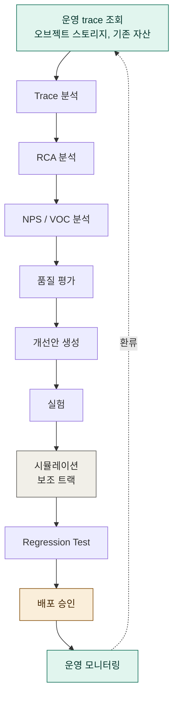

각 단계는 이전 단계의 출력을 입력으로 받으며, 운영 모니터링(K)의 결과는 다시 운영 trace 조회(A)로 환류되어 순환을 이룬다. A 단계는 신규 수집이 아니라 **기존에 통합 수집된 오브젝트 스토리지 trace의 조회**임에 유의한다.

### 2.3 조직 및 책임 (RACI 관점)

| 영역 | 주체 | rag-insight에서의 역할 |
|---|---|---|
| 콘텐츠(FAQ/매뉴얼/정책) | 삼성전자 | RCA에서 CONTENT 계열로 분류된 Action Item의 owner. 직접 시스템을 사용하지 않으나, 개선 권고의 대상 |
| 파이프라인(이해/검색/생성) | 삼성SDS 엔지니어링팀 | rag-insight 1차 사용자. RCA 리뷰, 실험 설계·실행, Quality Gate 검토, 배포 승인 |
| 정책/안전 | 정책 담당 | POLICY 계열 RCA의 owner |
| 인프라/플랫폼 | SDS 플랫폼팀 | K8S, PostgreSQL, 오브젝트 스토리지, ES 등 기존 인프라 운영 및 rag-insight 자체의 가용성 책임 |

### 2.4 핵심 비즈니스 규칙

- 운영 trace는 오브젝트 스토리지에 이미 구조화·통합 수집되어 있으며, rag-insight는 이를 읽기 전용으로 조회한다(신규 수집 인프라 없음).
- 모든 trace는 불변(immutable)이며, 피드백(NPS/VOC)은 trace와 함께 통합 수집된 데이터에서 식별·활용한다.
- RCA의 1차 라벨은 LLM judge가 수행하되, 저신뢰·콘텐츠 귀속·다중 원인 충돌 케이스는 사람 리뷰를 거친다.
- 배포 승인은 절대 임계값이 아닌, 골든셋 기반 상대 비교(현재 버전 대비 회귀 없음 + 목표 지표 유의 개선)로 판정한다.
- 시뮬레이션(Synthetic User, NPS Prediction)은 엣지케이스 발굴용 실험 트랙으로만 사용하며, 배포 게이트에 직접 연결하지 않는다.

---

## 3. 시스템 구성도

### 3.1 전체 구성 개요

rag-insight는 기존 RAG 챗봇 인프라(K8S 기반)와 동일한 클러스터·기술 스택을 공유하는 **경량 추가 레이어**이다. 기존 인프라는 운영 서비스(Gauss 생성, e5 임베딩, ES 임베딩 인덱스, 오브젝트 스토리지 trace 적재, 메타데이터 PostgreSQL)를 담당하며, 이 중 변경되는 부분은 없다. rag-insight 신규 구성요소는 (1) 오브젝트 스토리지를 주기적으로 조회·적재하는 **배치 워커**, (2) 진단·평가·개선 상태를 저장하는 **PostgreSQL `rag_insight` 스키마**, (3) **rag-insight-ui** 뿐이다.

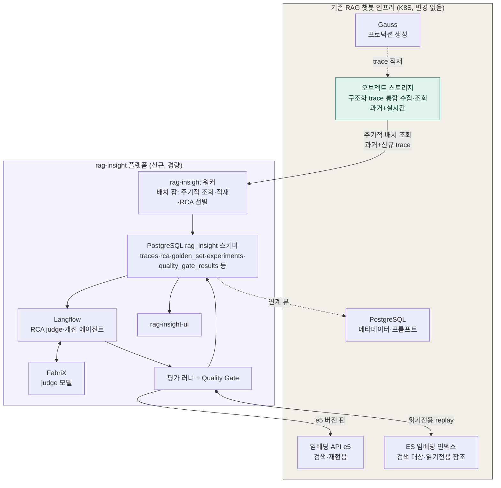

> 이전 검토에서 고려되었던 신규 Kafka 토픽(`rag.*`), Fluent Bit, ES 신규 trace 인덱스, 백필 어댑터는 **모두 불필요**하다. 오브젝트 스토리지가 이미 구조화 trace의 통합 조회 지점이므로, rag-insight 워커는 이를 직접 조회하는 배치 잡으로 충분하다.

### 3.2 레이어 구성

| 레이어 | 구성 요소 | 비고 |
|---|---|---|
| 데이터 소스 | 오브젝트 스토리지(구조화 trace, 기존 운영 자산) | 신규 수집 없음, 읽기 전용 조회 |
| 저장(Storage) | PostgreSQL(`rag_insight` 스키마) | 진단·평가·개선 상태의 단일 저장소 |
| 진단(Diagnosis) | rag-insight 워커(배치), Langflow(RCA judge 플로우), FabriX | 주기적 조회 → RCA 대상 선별 → LLM 1차 라벨링 → 사람 리뷰 큐 |
| 평가(Evaluation) | 평가 러너(`eval/runner`), Quality Gate | 골든셋 replay, 부트스트랩 통계 판정 |
| 개선(Improvement) | Langflow(에이전트), PostgreSQL(버전 관리) | Action Item → 실험 제안 → 버전 레코드 |
| 배포(Deployment) | PostgreSQL(승인 워크플로), K8S | PostgreSQL 기반 승인 절차 → 배포(10장) |
| 표시(Presentation) | rag-insight-ui(React) | RCA 리뷰 큐, Trace 뷰어, Quality Gate 대시보드 |

### 3.3 기존 자산 활용 원칙

rag-insight는 신규 인프라를 최소화하고 기존 자산을 최대한 그대로 활용한다.

- **오브젝트 스토리지**: 변경 없음. rag-insight 워커가 주기적 배치로 읽기 전용 조회한다.
- **Elasticsearch**: 기존 임베딩 인덱스만 사용하며, rag-insight는 retrieval 평가(replay) 시에만 읽기 전용으로 질의한다. 신규 인덱스를 추가하지 않는다.
- **PostgreSQL**: 기존 "메타데이터(프롬프트 등)" 스키마는 유지하고, rag-insight 전용 테이블은 별도 스키마(`rag_insight`)에 둔다. 필요한 경우 뷰를 통해 연계한다. **본 플랫폼의 진단·평가·개선·배포 승인 상태가 모두 이 스키마에 저장된다(13장 참조).**
- **신규 구성요소는 워커(배치 잡), `rag_insight` 스키마, `rag-insight-ui` 세 가지로 한정**된다(13장 기술 스택 참조).

### 3.4 컴포넌트 간 상호작용 개요

rag-insight 워커는 주기적 배치 잡으로 동작하여, 오브젝트 스토리지에서 마지막 처리 시점 이후의 신규 trace를 조회한다. 조회된 trace는 전체 payload(JSONB)와 집계용 컬럼으로 PostgreSQL(`rag_insight.traces`)에 적재되고, 저NPS·VOC·에러 조건을 만족하는 trace는 같은 배치 내에서 RCA 대상으로 플래그(`rca_status='pending'`)된다. Langflow의 RCA judge 플로우(FabriX 호출)는 이 플래그가 설정된 trace를 PostgreSQL에서 폴링하여 1차 라벨링하며, 라우팅 규칙에 따라 자동확정 또는 rag-insight-ui의 사람 리뷰 큐로 전달된다. 확정된 RCA는 owner가 자동 도출되어 Action Item이 생성된다. Action Item은 Langflow 에이전트를 통해 실험으로 설계되고, 평가 러너가 골든셋을 기존 ES 임베딩 인덱스에 동일 e5 버전으로 replay하여 Quality Gate를 산출한다. 게이트 결과는 PostgreSQL에 기록되며, 승인 워크플로(10장)를 거쳐 배포가 반영되고 운영 모니터링으로 환류한다.

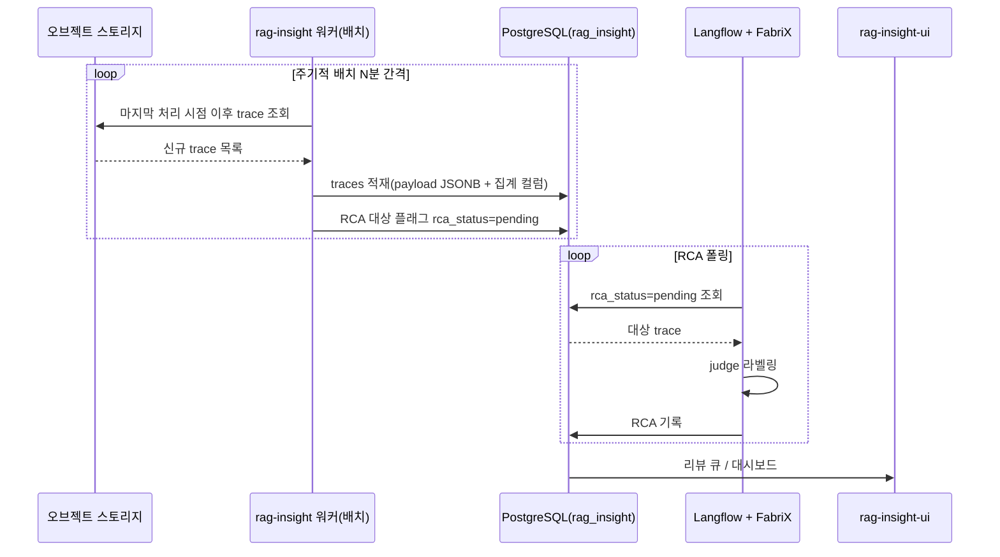

> 본 문서 전체에 mermaid 다이어그램을 배치하여 흐름·구조를 시각적으로 확인할 수 있도록 구성하였다.
## 4. 구성 요소 상세

### 4.1 데이터 소스 — 오브젝트 스토리지 (기존 자산, 변경 없음)

#### 4.1.1 Trace 데이터 형태

오브젝트 스토리지에는 RAG 챗봇 파이프라인의 trace가 요청(턴) 단위로 구조화되어 적재되어 있다. 각 trace는 `schema_version`, `trace_id`, `session_id`, `conversation_id`, `turn_index`, `service_version`과 함께 단계별 오브젝트(`understanding`, `retrieval`, `rerank`, `context`, `generation`)를 포함하며, 각 단계 오브젝트는 공통적으로 `latency_ms`, 버전 정보(`model_version`/`prompt_version`/`embedding_version`), 선택적으로 `confidence`와 `error`를 포함한다. NPS/VOC 피드백도 trace와 함께 통합 수집되어 조회 가능하다.

이 구조는 **기존 운영 자산**으로 이미 확립되어 있으며, rag-insight는 이 스키마를 계약(contract)으로 삼아 조회·소비한다. trace 스키마 자체의 필드 정의는 6.2에서 다룬다.

#### 4.1.2 과거분 + 실시간분 통합 조회

오브젝트 스토리지는 플랫폼 도입 이전의 과거 운영 기간 trace와, 현재 진행 중인 실시간 trace를 동일한 구조·동일한 조회 인터페이스로 제공한다. 따라서 rag-insight 워커는 "백필"과 "실시간 수집"을 구분할 필요 없이, **단일한 주기적 조회 로직**으로 과거분(최초 1회, 대량)과 신규분(이후 주기적, 증분)을 모두 처리한다.

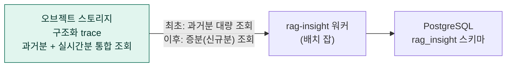

### 4.2 저장 계층

#### 4.2.1 Elasticsearch — 기존 임베딩 인덱스 (읽기 전용 참조)

RAG 챗봇의 검색 대상 인덱스. rag-insight는 retrieval 평가(replay) 시에만 이 인덱스에 질의하며, 쓰기 작업은 수행하지 않는다. 인덱스의 소유권과 운영 책임은 기존 임베딩 처리 파이프라인 팀에 있다. **rag-insight를 위한 신규 ES 인덱스는 두지 않는다.**

#### 4.2.2 PostgreSQL — `rag_insight` 스키마 (단일 저장소)

`traces`(턴 단위 메타 + 전체 trace payload JSONB), `sessions`, `rca_causes`(택소노미), `rca`, `rca_contributing_causes`, `action_items`, `golden_set`, `experiments`, `experiment_runs`, `quality_gate_results`, **그리고 프롬프트/config/골든셋 버전 관리 테이블(`config_versions`)과 배포 승인 워크플로 테이블(`deployment_approvals`)**로 구성된다(10장, 13장 참조). 기존 "메타데이터(프롬프트 등)" 스키마와는 별도 스키마로 분리하되, `golden_set`/`config_versions`는 프롬프트 버전 메타를 참조하는 뷰(`v_golden_set_with_prompt`)를 통해 연계한다. 테이블 구조는 6장(데이터 아키텍처)에서 상세히 다룬다.

> rag-insight의 진단·평가·개선·배포 상태는 **PostgreSQL `rag_insight` 스키마에 전부 모인다.** ES는 검색 replay 전용, 오브젝트 스토리지는 trace 원본 조회 전용이다.

### 4.3 진단 계층

#### 4.3.1 rag-insight 워커 (배치 잡)

워커는 K8S CronJob(또는 동등한 스케줄러)로 동작하는 배치 잡이며, 주기(예: N분)마다 다음을 수행한다.

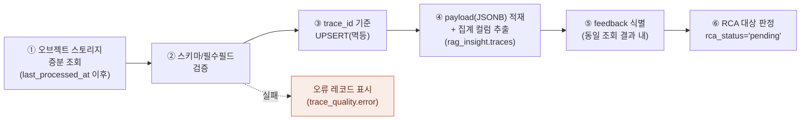

1. `last_processed_at`(워커 상태 테이블에 기록) 이후의 trace를 오브젝트 스토리지에서 조회한다. 최초 실행 시에는 과거분 전체를 대상으로 한다.
2. `schema_version` 및 필수 필드를 검증한다. 실패한 레코드는 적재하되 `trace_quality.error`에 사유를 기록한다(별도 DLQ 없음 — PostgreSQL 내 오류 플래그로 충분).
3. `trace_id` 기준 UPSERT로 적재하여 중복 조회·재실행을 멱등 처리한다.
4. 전체 trace를 `rag_insight.traces.payload`(JSONB)로 적재하고, 동시에 집계·필터에 쓰이는 필드(`service_version`, `total_latency_ms`, `has_error` 등)를 별도 컬럼으로 추출한다. 이로써 이후 judge·Trace 뷰어·대시보드가 PostgreSQL 단건/집계 조회만으로 동작한다.
5. 동일 조회 결과에 포함된 NPS/VOC 피드백을 `session_id` 기준으로 식별하여 `sessions`에 반영한다.
6. 저NPS·complaint·error 조건을 만족하는 trace는 `rca_status='pending'`으로 플래그한다(정상 trace는 층화 샘플링으로 일부만 플래그).

#### 4.3.2 Langflow — RCA judge 플로우 (PostgreSQL 폴링)

Langflow의 RCA judge 플로우는 `rag_insight.traces`에서 `rca_status='pending'`인 trace를 주기적으로 폴링하여 조회한다. 이때 `traces.payload`(JSONB)에 전체 trace가 보관되어 있으므로, 별도의 원본 저장소 재조회 없이 judge 입력(쿼리, rewrite, retrieved/reranked 요약, context, response, complaint, 택소노미)을 PostgreSQL 단건 조회만으로 조립한다. 이를 FabriX judge 모델에 전달하여 strict JSON(`primary_cause`, `contributing_causes`, `confidence`, `evidence`, `sds_judgement`)을 받는다. Langflow는 이 플로우의 정의·소량 검증을 담당하며, 운영 대량 처리는 동일 계약을 구현한 워커(`rca_judge.py`)가 수행한다.

#### 4.3.3 FabriX (Judge 모델)

RCA 1차 라벨링 및 생성 메트릭(`faithfulness`, `correctness`) 채점을 담당한다. 프로덕션 생성 모델인 Gauss와는 **다른 모델 계열**을 사용하여 self-judge bias를 방지한다. judge 모델/프롬프트 버전은 `labeled_by` 필드에 고정 기록되며, judge 버전 변경 시 과거 라벨과 자동으로 구분된다.

#### 4.3.4 라우팅 규칙 (자동확정 vs 사람 리뷰)

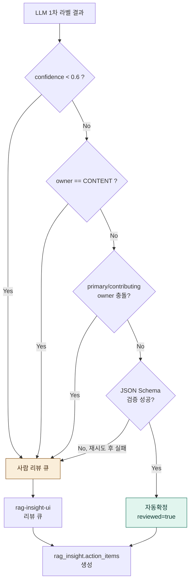

### 4.4 평가 계층

#### 4.4.1 평가 러너 (`eval/runner`)

활성·비stale 골든셋을 control/candidate 두 변형(config)으로 replay하여 메트릭별 per-query 값을 산출한다. retrieval 메트릭(`recall@k`, `ndcg@k`, `mrr`)은 결정적으로 계산하며, 생성 메트릭(`faithfulness`, `correctness`)은 FabriX judge로 채점한다. control/candidate config는 PostgreSQL `config_versions`에서 조회한다(10장 참조).

#### 4.4.2 ESReplayPipeline / E5Embedder

retrieval replay는 파인튜닝 e5 임베딩 API로 질의를 임베딩한 뒤, 기존 ES 임베딩 인덱스에 동일 인덱스·동일 임베딩 버전으로 질의한다. `E5Embedder`는 요청 시 `expected_version`을 명시하고, API가 보고하는 서빙 버전이 다르면 즉시 `EmbeddingVersionMismatch`를 발생시켜 평가를 중단한다. 이는 replay 결과가 프로덕션과 다른 임베딩 공간에서 산출되는 것을 방지한다.

#### 4.4.3 Quality Gate

control과 candidate의 paired per-query 메트릭 차이(delta)에 대해 부트스트랩 신뢰구간을 계산하여 유의성(`significant`)과 회귀(`regression`)를 판정한다. 통과 조건은 (a) 어떤 메트릭도 유의한 회귀가 없고 (b) 목표 메트릭이 유의하게 개선되는 것이다. 표본 수가 `min_n` 미만이면 판정을 보류(`passed=null`)한다. 상세 로직은 7장에서 다룬다. 결과는 PostgreSQL `quality_gate_results`에 기록되며, 이는 10장의 배포 승인 워크플로 입력이 된다.

### 4.5 개선 계층

#### 4.5.1 Action Item

RCA 확정 결과로부터 생성되며, `root_cause`로부터 `owner`가 자동 도출된다(트리거). `priority`, `status`(Open/InProgress/Resolved/Verified/Closed), `assignee`, `due_date`를 가진다.

#### 4.5.2 Langflow — 개선 에이전트

Action Item이 생성되면 Langflow 에이전트가 실험(target: prompt/embedding/chunking/retrieval/rerank)을 제안한다. 제안된 실험은 PostgreSQL `config_versions`에 새로운 candidate 버전 레코드로 기록되며, 사람이 검토·승인한 뒤 평가 러너가 실행한다. Langflow는 제안(설계) 단계를, 평가 러너는 실행(측정) 단계를 담당하는 경계를 유지한다.

### 4.6 표시 계층 — rag-insight-ui

| 화면 | 주요 기능 | 데이터 소스 |
|---|---|---|
| RCA 리뷰 큐 | 사람 리뷰 대상 trace 목록, LLM 제안·근거 확인, 택소노미 정정, 라벨 확정 | `rag_insight.rca` (is_current, reviewed) |
| Trace 뷰어 | 단계별 latency·상태, 정답 문서의 retrieval→rerank→context 추적 | `rag_insight.traces`(메타 컬럼 + `payload` JSONB) |
| Quality Gate | 실험별 메트릭 비교(control vs candidate), CI, 유의성, 회귀/통과 판정 | `rag_insight.quality_gate_results`, `experiments` |
| 배포 승인 | config 버전 비교, 게이트 결과, 승인/반려 처리 | `rag_insight.config_versions`, `deployment_approvals`(10장) |
| Executive/Engineering/Operations 대시보드 | NPS·Top RCA·품질 추세, Pipeline/Retrieval/Generation 품질, Action Item·승인 현황·운영 알람 | `rag_insight` 집계 뷰 |

---

## 5. 처리 흐름도

### 5.1 운영 trace 조회 및 적재 흐름

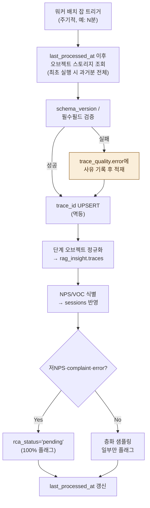

### 5.2 RCA 라벨링 흐름

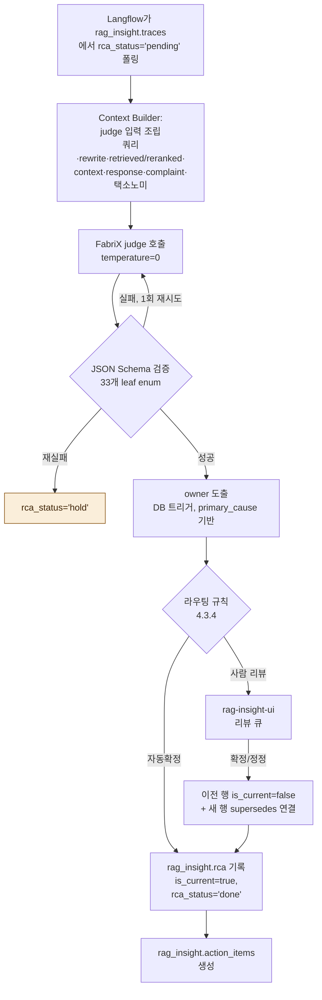

사람이 LLM 라벨을 수정하는 경우, 이전 행을 `is_current=false`로 내리고 새 행을 `supersedes`로 연결한다(라벨 이력 보존, judge 캘리브레이션 집계의 기초).

### 5.3 개선 → 평가 → 배포 흐름

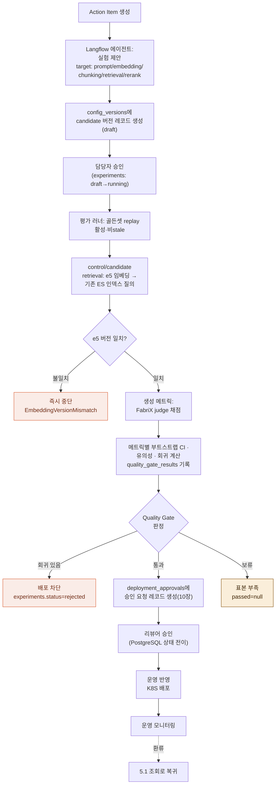

### 5.4 피드백(NPS/VOC) 처리

NPS와 VOC는 trace와 함께 오브젝트 스토리지에 통합 수집되어 있으므로, 워커는 trace 조회 시 동일 레코드(또는 동일 `session_id`로 연결된 레코드)에서 피드백을 함께 식별한다. 별도의 지연 도착 이벤트 처리(메시지 큐 join)는 필요하지 않다.

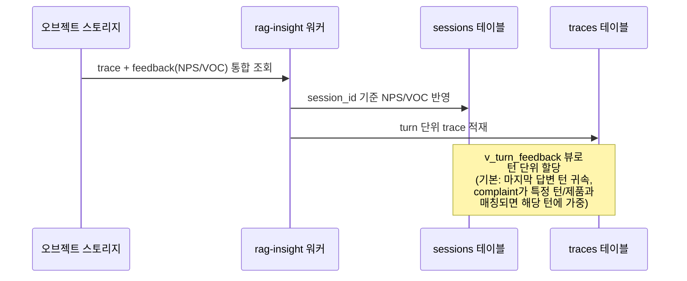

NPS는 세션 점수이므로 턴 trace에 직접 기록하지 않고 `sessions` 테이블에 저장하며, 턴 단위 분석이 필요한 경우 `v_turn_feedback` 뷰를 통해 할당 규칙을 적용한다.
## 6. 데이터 아키텍처

### 6.1 데이터 흐름 개관

데이터는 (1) 오브젝트 스토리지(trace 원본, 읽기 전용·증분 조회), (2) PostgreSQL `rag_insight` 스키마(trace payload + 진단·평가·개선·배포 상태), (3) 기존 ES 임베딩 인덱스(replay 전용 참조)의 세 영역으로 단순화된다. 워커는 오브젝트 스토리지에서 읽은 trace의 전체 payload를 PostgreSQL `traces.payload`(JSONB)에 적재하고, 동시에 join·필터·집계에 자주 쓰이는 필드(`service_version`, `total_latency_ms`, `has_error` 등)를 별도 컬럼으로 추출한다. 이로써 RCA judge 입력 조립, Trace 뷰어 단건 조회, 대시보드 집계가 **모두 PostgreSQL 단일 조회로 처리**되며, 오브젝트 스토리지는 최초 적재 시점 이후 재조회가 필요 없다(원본 보존·재처리 용도로만 유지).

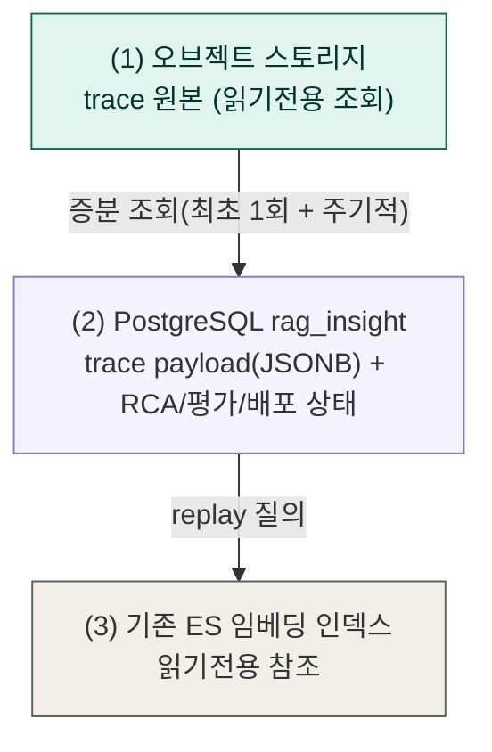

### 6.2 Trace 스키마 핵심 필드 (오브젝트 스토리지 원본 = `traces.payload`)

| 필드 | 설명 |
|---|---|
| `schema_version` | 스키마 버전. 워커는 지원 버전만 정상 처리, 미지원 시 `trace_quality.error`에 기록 후 적재 |
| `trace_id` / `session_id` / `conversation_id` / `turn_index` | 식별자 및 세션 내 턴 순번(NPS 할당에 사용) |
| `service_version` | trace를 생성한 파이프라인 버전. 회귀 비교의 기준선 |
| `understanding` / `retrieval` / `rerank` / `context` / `generation` | 단계별 오브젝트. 공통적으로 `latency_ms`, 버전, 선택적 `confidence`/`error` 포함 |
| `retrieval.embedding_version` | retrieval replay 시 프로덕션과 동일 버전이어야 함 |
| `retrieved[].content_version` | 골든셋 `expected_documents`와의 버전 정합성 검증에 사용 |
| `context.dropped_by_limit` | top-k/토큰 한도로 잘려나간 청크 수. `CONTEXT_SELECTION_ERROR` 진단 근거 |
| `generation.prompt_hash` | 프롬프트 버전·내용을 식별하는 해시값. judge 호출 캐시 키로 활용(14.6) |
| `feedback.nps_score` / `complaint` | trace와 함께 통합 수집된 세션 단위 피드백 |
| `trace_quality.error` | 단계 실패 정보 또는 워커의 스키마 검증 오류 사유. SYSTEM 계열 RCA로 라우팅 |

### 6.3 PostgreSQL 핵심 테이블 (`rag_insight` 스키마)

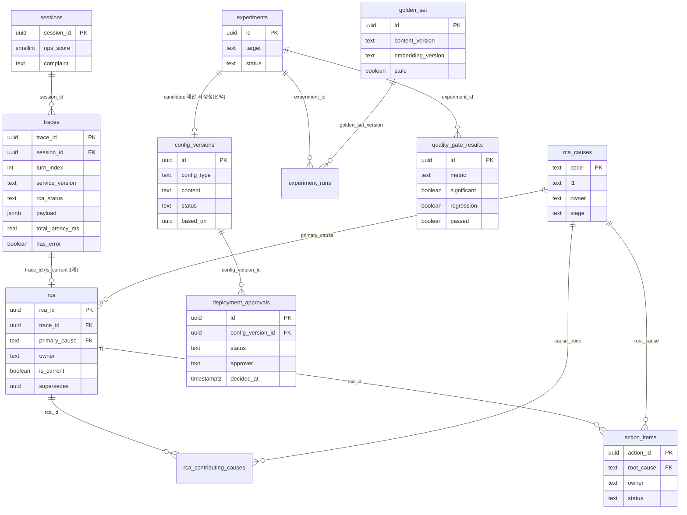

| 테이블 | 역할 | 핵심 관계/제약 |
|---|---|---|
| `sessions` | 세션 단위 NPS/VOC 보관 | `traces.session_id`가 참조 |
| `traces` | 턴 단위 메타 + 전체 trace payload(JSONB) | `trace_id` PK(오브젝트 스토리지 원본 키와 동일). `payload`에 전체 trace를 JSONB로 보관하여 judge 입력·Trace 뷰어·집계의 단일 조회원이 됨. `total_latency_ms`/`has_error` 등 집계·필터용 컬럼은 적재 시 payload에서 추출(생성 컬럼 또는 워커 산출). `rca_status`(pending/done/hold) 포함 |
| `rca_causes` | RCA 택소노미(33개 leaf). owner/stage의 단일 진실원 | `code` PK |
| `rca` | RCA 라벨(이력 보존) | `trace_id`당 `is_current=true` 1개만 허용(부분 유니크 인덱스). `owner`는 `primary_cause`로부터 트리거 자동 도출 |
| `rca_contributing_causes` | 다중 원인(N:1) | `(rca_id, cause_code)` 복합 PK |
| `action_items` | 개선 작업 항목 | `root_cause`로부터 `owner` 자동 도출(트리거 없으면 수동) |
| `golden_set` | 품질 검증 기준 데이터 | `content_version`/`embedding_version`에 버저닝, `stale` 플래그 |
| `experiments` / `experiment_runs` | 실험 정의 및 실행 결과 | `experiments.status`는 게이트 결과로 갱신 |
| `quality_gate_results` | 메트릭별 게이트 판정 | control/candidate 값, delta, CI, significant, regression, passed |
| `config_versions` | **프롬프트/검색 config/골든셋 버전 관리** | `config_type`(prompt/search_config/golden_set), `content`(버전 페이로드), `status`(draft/proposed/approved/rejected/active), `based_on`(이전 버전 참조) — 10장 |
| `deployment_approvals` | **배포 승인 워크플로** | `config_version_id` FK, `status`(pending/approved/rejected), `approver`, `decided_at` — 10장 |

> `config_versions`와 `deployment_approvals`는 기존 git enterprise(소스코드 형상관리 전용, 13장 참조)를 대체하여 프롬프트·config·골든셋의 버전 이력과 배포 승인 상태를 PostgreSQL에서 직접 관리한다.

### 6.4 RCA 라벨 생애주기

라벨은 불변이며 이력으로 보존된다.

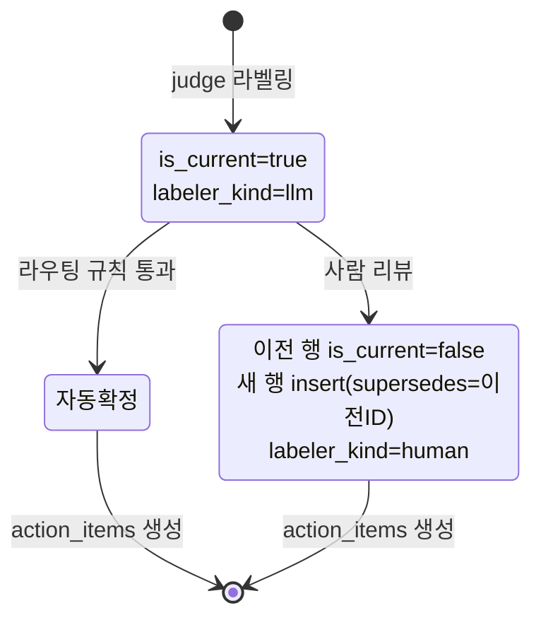

LLM이 1차 라벨을 생성하면 `is_current=true`로 기록되고, 사람이 이를 정정하면 이전 행을 `is_current=false`로 먼저 내린 뒤 새 행을 `supersedes`로 연결하여 insert한다(부분 유니크 인덱스 `uq_rca_current`가 trace당 현재 라벨 1개를 강제). `v_rca_current` 뷰는 현재 라벨만 노출하며, `v_judge_calibration` 뷰는 사람이 정정한 사례에서 LLM 1차 라벨과의 일치율을 judge 버전별로 집계하여 judge 신뢰도 모니터링의 기초 데이터를 제공한다.

### 6.5 골든셋 데이터 관리

- 골든셋의 `expected_documents`는 `content_version`과 `embedding_version`에 묶여 관리되며, 참조 콘텐츠가 갱신되면 `stale=true`로 표시된다.
- `validated_at`은 마지막 재검증 시점이며, 재검증 잡은 활성 골든셋을 현재 인덱스로 replay하여 `expected`가 여전히 검색되는지 확인한다.
- 평가·게이트는 `stale=false`인 골든셋만 사용한다.
- 골든셋 자체도 `config_versions`(`config_type='golden_set'`)를 통해 버전 관리되어, 골든셋 변경 이력과 영향받은 평가 결과를 추적할 수 있다.

### 6.6 멱등성 및 순서 보장

배치 재실행이나 장애 복구 시 워커가 동일 trace를 다시 조회·적재할 수 있으므로, `rag_insight.traces`와 `sessions`는 각각 `trace_id`/`session_id` 기준 UPSERT로 처리하여 중복 적재를 무해화한다. 워커는 `last_processed_at`(또는 동등한 워터마크)을 PostgreSQL에 기록하여, 배치 실행 간 조회 구간이 중첩되어도 결과가 멱등하게 유지되도록 한다. 피드백이 trace 적재 시점에 아직 도착하지 않은 경우에도 `sessions` 행을 UPSERT하여 out-of-order를 안전하게 처리한다.

---

## 7. 평가 아키텍처

### 7.1 평가 체계 개요

평가는 세 축으로 구성된다.

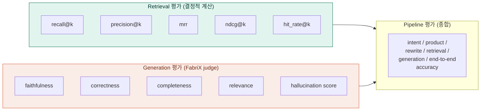

Retrieval 메트릭은 결정적으로 계산되어 재현성이 보장되며, Generation 메트릭은 FabriX judge가 채점하여 노이즈를 동반한다. 이 노이즈를 다루기 위해 Quality Gate는 절대 임계값이 아닌 통계적 판정을 사용한다(7.4).

### 7.2 골든셋 Replay 절차

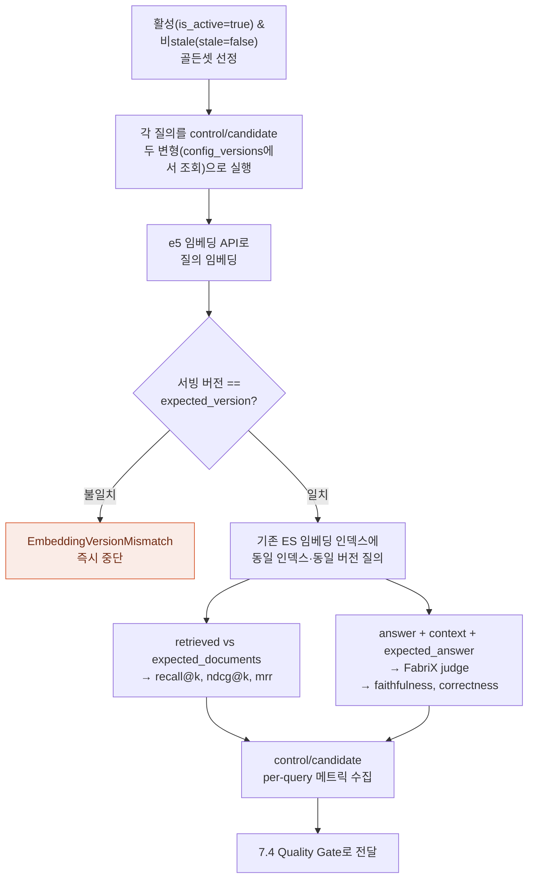

이 검증(D)은 응답 파싱보다 먼저 수행되어, 버전 불일치 상황에서 무관한 파싱 오류로 원인이 가려지지 않도록 한다.

### 7.3 메트릭 정의 및 방향성

| 메트릭 | 방향 | 정의 |
|---|---|---|
| `recall@k` | 높을수록 좋음 | 상위 k개 검색 결과 중 정답 문서가 포함된 비율 |
| `precision@k` | 높을수록 좋음 | 상위 k개 중 정답 문서의 비율 |
| `mrr` | 높을수록 좋음 | 정답 문서가 처음 등장한 순위의 역수(Mean Reciprocal Rank) |
| `ndcg@k` | 높을수록 좋음 | 순위를 고려한 정규화 누적 이득(Normalized DCG) |
| `hit_rate@k` | 높을수록 좋음 | 상위 k개 내 정답 문서 존재 여부(이진) |
| `faithfulness` | 높을수록 좋음 | 응답이 제공된 컨텍스트에 근거하는 정도 |
| `correctness` | 높을수록 좋음 | 응답이 `expected_answer`와 일치하는 정도 |
| `hallucination_rate` | 낮을수록 좋음 | 컨텍스트에 근거하지 않은 내용을 생성한 비율 |

> 메트릭명에 `@k`가 포함된 경우(예: `recall@5`) family 단위(`recall@k`)로 방향성을 조회한다.

### 7.4 Quality Gate 판정 로직

각 메트릭에 대해 control과 candidate의 paired per-query 값 차이(`delta = candidate − control`)를 계산하고, 이 delta들의 평균에 대해 부트스트랩 신뢰구간(기본 95%, 2000회 리샘플링)을 산출한다. 신뢰구간이 0을 포함하지 않으면 유의(`significant=true`)하다고 판정한다.

회귀(`regression`) 판정은 메트릭 방향성에 따라 다르다: `higher_better` 메트릭은 유의하고 `delta < 0`이면 회귀, `lower_better` 메트릭은 유의하고 `delta > 0`이면 회귀이다.

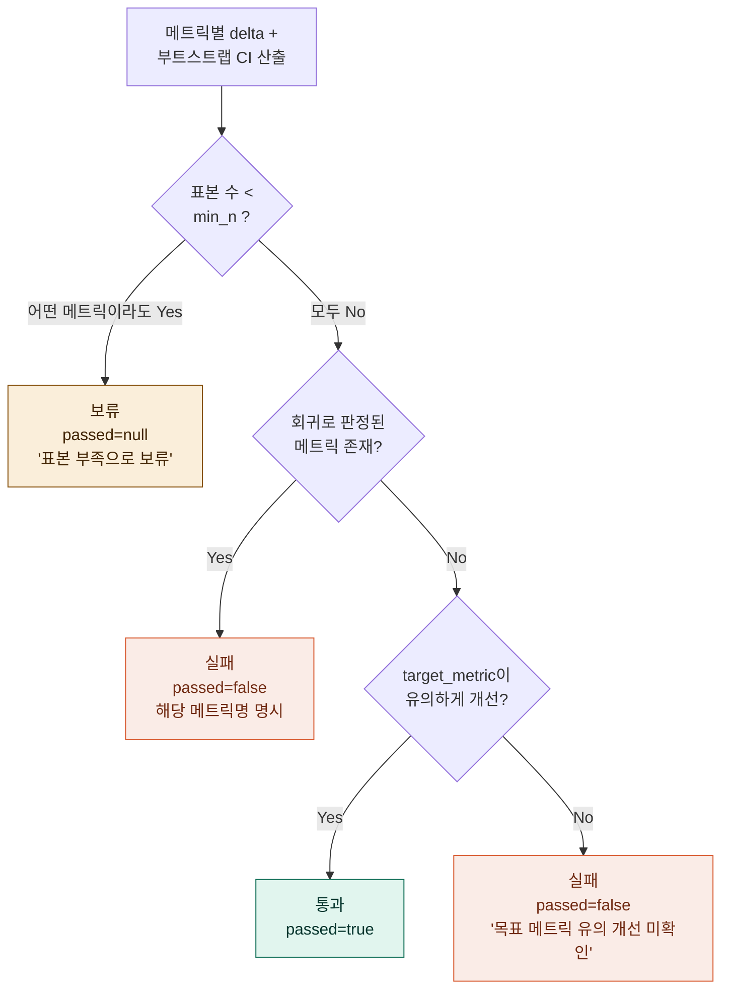

전체 게이트 판정(`decide`)은 위 그림의 우선순위로 결정된다: (1) 표본 부족 → 보류, (2) 회귀 존재 → 실패, (3) 목표 메트릭 유의 개선 → 통과, (4) 그 외 → 실패.

### 7.5 게이트 결과 활용

`quality_gate_results` 테이블에는 메트릭별 `control_value`, `candidate_value`, `delta`, `ci_low`, `ci_high`, `significant`, `regression`, `passed`가 기록된다. 게이트 판정 결과(`decision.passed`)에 따라 `experiments.status`가 `approved`(true)/`rejected`(false)/`compared`(null, 보류)로 갱신된다. 통과한 경우 `config_versions`의 candidate 레코드가 `proposed` 상태로 전이되어 10장의 배포 승인 워크플로(`deployment_approvals`)로 진입한다.

### 7.6 평가의 한계와 보완

- LLM judge(FabriX) 채점은 노이즈를 동반하므로, 절대 임계값이 아닌 유의성 기반 판정을 사용한다.
- judge 신뢰도는 `v_judge_calibration` 뷰를 통해 사람 검수와의 일치율로 주기적으로 모니터링한다. 일치율이 기준 미만이면 judge 모델/프롬프트 교체를 검토한다.
- 현재 RCA 및 평가는 턴 단위이다. 대화 맥락·메모리 실패는 턴 단위로 포착되지 않으며, 세션 단위 RCA로의 확장은 14장(향후 확장 전략)에서 다룬다.
## 8. 개선 아키텍처

### 8.1 개선 루프 개요

개선 아키텍처는 RCA 결과를 실질적인 변경(프롬프트, 검색 파라미터, 청킹 전략 등)으로 전환하고, 그 변경이 회귀 없이 효과가 있는지 검증하는 절차를 제공한다. 핵심 경계는 "제안(설계)"과 "실행(측정)"을 분리하는 것이다. Langflow가 제안을, 평가 러너(`eval/runner`)와 Quality Gate가 실행과 측정을 담당하며, 모든 변경 이력은 PostgreSQL `config_versions`에 기록된다(10장).

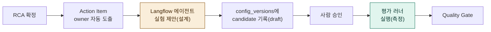

### 8.2 RCA → Action Item 매핑

RCA 택소노미의 각 leaf는 (파이프라인 단계, owner, 대표 개선 액션)에 매핑된다. 예시는 아래와 같다.

| RCA leaf | owner | 대표 개선 액션 |
|---|---|---|
| `FAQ_MISSING` / `OUTDATED_SPEC` / `POOR_STRUCTURE` | CONTENT | FAQ 생성·갱신·구조 개선 권고(직접 생성하지 않음) |
| `INTENT_ERROR` / `REWRITE_DRIFT` | SDS | 의도분류기 보정 / rewrite 프롬프트 수정 |
| `LOW_RECALL` / `HYBRID_IMBALANCE` | SDS | top_k·하이브리드 가중치 재탐색 실험 |
| `RERANK_ERROR` | SDS | reranker 교체·튜닝 실험 |
| `CONTEXT_SELECTION_ERROR` | SDS | context 선택 로직·한도 조정 |
| `PROMPT_ERROR` / `HALLUCINATION` | SDS | 프롬프트 수정 + A/B 실험(grounding 강화) |
| `LATENCY` / `SERVICE_ERROR` | PLATFORM | 병목 단계 최적화, 인프라 조치 |

> CONTENT로 귀속된 Action Item은 플랫폼이 직접 콘텐츠를 생성하지 않고 권고만 수행한다. 책임 경계를 넘지 않는다.

### 8.3 콘텐츠 vs 파이프라인 경계 (자주 혼동되는 사례)

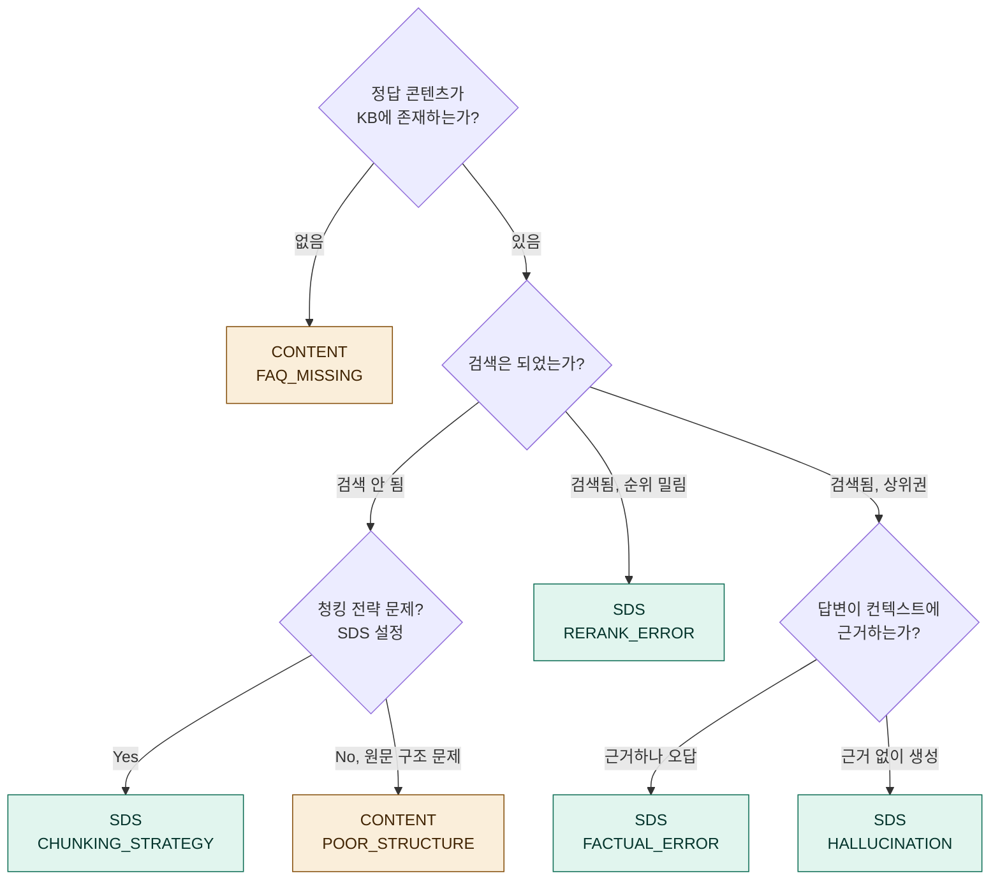

### 8.4 실험 설계 — Langflow 에이전트

Action Item이 생성되면 Langflow 에이전트가 `root_cause`와 `evidence`를 바탕으로 실험(target: prompt/embedding/chunking/retrieval/rerank)을 제안하고, `base_service_version` 대비 candidate 변경안을 `config_versions`에 `config_type`(prompt/search_config/golden_set), `status='draft'`, `based_on`(기준 버전 참조)으로 기록하며 동시에 `experiments` 테이블에 `draft` 상태로 생성한다. 제안은 사람이 검토하여 승인(`running`으로 전환)한다.

### 8.5 실험 실행 — 평가 러너

승인된 실험은 평가 러너가 7장의 절차로 control(`config_versions.status='active'`인 현재 버전)과 candidate(`config_versions.status='draft'`인 제안 버전)를 골든셋에 replay하고, Quality Gate 결과를 `experiment_runs`와 `quality_gate_results`에 기록한다.

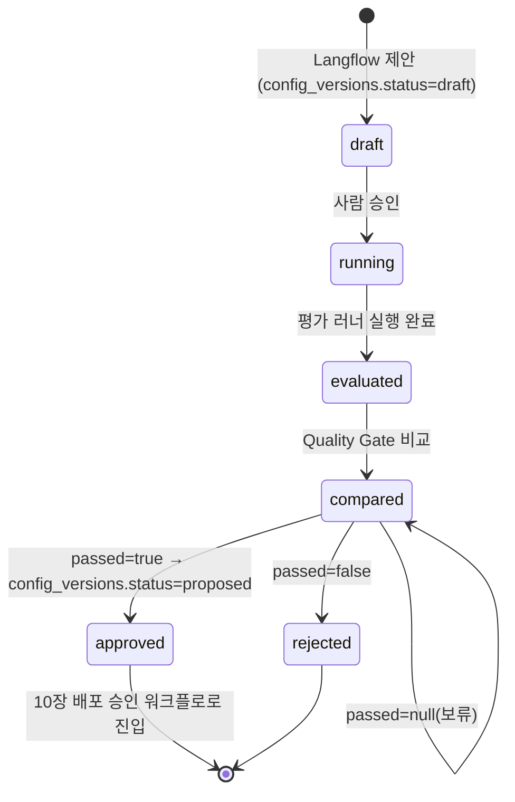

### 8.6 Prompt 최적화 / Search 최적화

프롬프트(System/Rewrite/Answer Prompt)와 검색 파라미터(Chunk Size/Overlap, Embedding, Hybrid Search, Metadata Filter, Rerank)는 모두 동일한 실험 → 평가 → 게이트 흐름을 따른다. 각 변경은 `config_versions`에 `config_type`별로 독립적인 버전 이력을 가지며, 비교·A/B·Rollback은 `experiments`/`experiment_runs`/`config_versions`의 이력으로 추적된다.

---

## 9. 시뮬레이션 아키텍처

### 9.1 위치와 역할

시뮬레이션(Synthetic User, Scenario Test, Conversation Test, NPS Prediction)은 골든셋으로 포착되지 않은 엣지케이스를 발굴하는 **실험 트랙**으로 운영한다. 시뮬레이션 결과는 Quality Gate(7.4)에 직접 연결하지 않으며, 배포 승인의 근거로 사용하지 않는다.

```mermaid
flowchart TB
    subgraph MAIN["메인 루프 - 배포 게이트 연결"]
        GS["골든셋"] --> EVAL["평가 러너 / Quality Gate"]
        EVAL --> DEPLOY["배포 승인 (10장)"]
    end

    subgraph SIM["시뮬레이션 트랙 - 게이트 비연결"]
        SU["Synthetic User"]
        ST["Scenario Test"]
        CT["Conversation Test"]
        NP["NPS Prediction"]
    end

    SIM -->|"사람 검토 후<br/>골든셋 편입 9.5"| GS

    style SIM fill:#F1EFE8,stroke:#5F5E5A
    style MAIN fill:#E1F5EE,stroke:#0F6E56,color:#04342C
```

> Synthetic User와 동일 계열 모델로 시뮬레이션을 생성·평가하면 실제 사용자 분포와 어긋나 거짓 안정감을 줄 수 있다. 이 한계를 인지하고 "탐색" 용도로 한정한다.

### 9.2 Synthetic User

초보 사용자, 전문가 사용자, 불만 사용자, 악성 사용자, Edge Case 사용자의 5개 페르소나로 합성 질의를 생성한다. 생성된 질의는 골든셋 후보로 검토될 수 있으나, 검토(사람 확인) 후에만 `golden_set`에 편입된다.

### 9.3 Scenario Test / Conversation Test

| 구분 | 내용 |
|---|---|
| Scenario Test | 제품 문의, AS 문의, 설치 문의, 환불 문의, 보증 문의 등 업무 시나리오별 질의 세트 |
| Conversation Test | Single Turn, Multi Turn, Long Session, Memory Validation. 현재 RCA/평가가 턴 단위인 한계(7.6)를 보완하기 위한 다중 턴 탐색 |

### 9.4 NPS Prediction

예상 NPS, Risk Score, Complaint Type, 개선 효과를 예측하는 기능이다. 신뢰도가 가장 낮은 영역으로 분류하며, 리서치·탐색 목적으로 격리하여 운영한다. 이 예측값은 배포 게이트의 입력으로 사용하지 않는다.

### 9.5 시뮬레이션 → 골든셋 편입 절차

```mermaid
flowchart LR
    A["Synthetic User /<br/>Scenario Test가<br/>새 실패 패턴 발견"] --> B["RCA 택소노미 leaf로<br/>분류"]
    B --> C["사람이 expected_answer /<br/>expected_documents<br/>검토·확정"]
    C --> D["golden_set에<br/>신규 버전 추가<br/>content_version,<br/>embedding_version 명시<br/>+ config_versions 기록"]
    D --> E["7장 정규 평가 대상에<br/>포함, Quality Gate에<br/>영향"]
```

---

## 10. 배포 아키텍처

### 10.1 배포 승인 원칙 — PostgreSQL 기반

git enterprise는 **rag-insight/rag-insight-ui 등 개발 소스코드의 형상관리 용도로만 사용**한다. 프롬프트, 검색 config, 골든셋의 **버전 관리와 배포 승인 워크플로는 PostgreSQL `rag_insight` 스키마**(`config_versions`, `deployment_approvals`)에서 직접 관리한다. 이는 코드 변경(PR/머지)과 운영 파라미터 변경(프롬프트·config·골든셋 버전 승인)의 라이프사이클이 서로 다르다는 점을 반영한 것이다 — 후자는 거의 매일 발생할 수 있는 반복적 튜닝이며, rag-insight-ui에서 직접 비교·승인이 이루어지는 것이 효율적이다.

```mermaid
flowchart LR
    subgraph CODE["코드 변경 (git enterprise)"]
        C1["rag-insight /<br/>rag-insight-ui<br/>소스코드"]
        C2["PR 리뷰 / 머지"]
        C1 --> C2
    end

    subgraph PARAM["운영 파라미터 변경 (PostgreSQL)"]
        P1["config_versions<br/>prompt / search_config /<br/>golden_set 버전"]
        P2["deployment_approvals<br/>승인 워크플로"]
        P1 --> P2
    end

    style CODE fill:#F1EFE8,stroke:#5F5E5A
    style PARAM fill:#F5F3FF,stroke:#7F77DD
```

### 10.2 배포 파이프라인 (PostgreSQL 승인 워크플로)

```mermaid
flowchart TD
    A["개선 제안 확정<br/>config_versions.status=proposed<br/>(Quality Gate 통과, 7.5)"] --> B["deployment_approvals에<br/>승인 요청 레코드 생성<br/>status=pending"]
    B --> C["rag-insight-ui:<br/>승인 화면에 노출<br/>(control vs candidate +<br/>Quality Gate 결과)"]
    C --> D{"리뷰어 검토"}
    D -->|승인| E["deployment_approvals.status=approved<br/>config_versions.status=active<br/>(이전 active는 superseded)"]
    D -->|반려| F["deployment_approvals.status=rejected<br/>config_versions.status=rejected"]
    E --> G["K8S 배포 파이프라인<br/>실행 (active config 반영)"]
    G --> H["운영 모니터링"]

    style F fill:#FAECE7,stroke:#D85A30,color:#712B13
    style E fill:#E1F5EE,stroke:#0F6E56,color:#04342C
```

회귀(`regression=true`)가 있는 메트릭이 존재하면 `config_versions.status`가 `proposed`로 전이되지 않으므로(7.5), `deployment_approvals` 자체가 생성되지 않아 자연스럽게 배포가 차단된다.

**운영 반영 방식.** `config_versions.status='active'`로 전이된 프롬프트·검색 config는 두 가지 중 RAG 챗봇 파이프라인의 구성에 맞는 방식으로 적용된다. (a) **런타임 조회형** — 파이프라인이 시작 시 또는 주기적으로 active 버전을 조회하여 메모리에 로딩하는 경우, 별도 재배포 없이 즉시(또는 다음 갱신 주기에) 반영된다. (b) **배포 트리거형** — config가 파이프라인 이미지/매니페스트에 포함되어야 하는 경우, active 전이가 K8S 배포 파이프라인을 트리거한다. 어느 방식이든 rag-insight는 "어떤 버전이 active인가"의 단일 진실원(`config_versions`)을 제공하며, 실제 로딩 메커니즘은 기존 파이프라인의 config 주입 방식을 따른다.

### 10.3 Quality Gate — Approval Workflow 매핑

| 원본 요구사항 단계 | rag-insight 구현 (PostgreSQL 기반) |
|---|---|
| 개선 완료 | `experiments.status = evaluated` (candidate 실행 완료) |
| 평가 완료 | `experiment_runs` / `quality_gate_results` 기록 완료 |
| Quality Gate 통과 | `decide()`의 `passed = true` → `config_versions.status = proposed` |
| 승인 요청 생성 | `deployment_approvals` 레코드 생성(`status=pending`) |
| 검토자 승인 | `deployment_approvals.status = approved` (rag-insight-ui) |
| 배포 승인 | `config_versions.status = active` (이전 버전은 superseded) |
| 운영 반영 | K8S 배포 파이프라인 실행 |

### 10.4 Regression Test

Regression Test는 7장의 골든셋 replay와 동일한 메커니즘이다. `config_versions.status='active'`인 버전을 control, 신규 candidate를 candidate로 두고 동일 골든셋 버전에서 비교한다. 골든셋 자체가 stale(`content_version`/`embedding_version` 불일치)인 경우 회귀 테스트에서 제외된다(6.5).

### 10.5 Rollback

`config_versions`는 `based_on`으로 이전 버전을 참조하는 이력 구조이므로, Rollback은 과거 `active` 버전을 새로운 candidate로 재제출하는 것과 동일하다. 즉 Rollback도 10.2의 승인 워크플로(Quality Gate 비교 → `deployment_approvals` 승인)를 동일하게 거친다.

---

## 11. 모니터링 아키텍처

### 11.1 운영 모니터링 (RAG 챗봇 품질)

| 지표 | 수집 방식 | 알람 조건(예시) |
|---|---|---|
| NPS | `traces`/`sessions`(워커 적재분) 집계 | 급락 시 알람 |
| Accuracy / Hallucination Rate | FabriX judge 채점 결과 집계(샘플링) | Hallucination 급증 시 알람 |
| Retrieval Quality | `traces.payload`의 retrieval/rerank 단계 메트릭 집계 | 검색 실패(빈 결과) 증가 시 알람 |
| Latency / Token Usage | `traces.total_latency_ms` / payload 내 token 필드 | Latency 증가(임계 초과) 시 알람 |

### 11.2 대시보드 구성

```mermaid
flowchart TB
    subgraph EXEC["Executive Dashboard"]
        E1["NPS 추세"]
        E2["Top RCA"]
        E3["품질 추세"]
        E4["개선 효과"]
    end
    subgraph ENG["Engineering Dashboard"]
        EN1["Pipeline 품질 추세"]
        EN2["Retrieval 품질 추세"]
        EN3["Generation 품질 추세"]
        EN4["실험 결과<br/>Quality Gate 이력"]
    end
    subgraph OPS["Operations Dashboard"]
        O1["Action Item 현황"]
        O2["배포 승인 현황<br/>deployment_approvals"]
        O3["운영 알람"]
    end

    style EXEC fill:#E1F5EE,stroke:#0F6E56,color:#04342C
    style ENG fill:#EEEDFE,stroke:#534AB7,color:#26215C
    style OPS fill:#FAEEDA,stroke:#854F0B,color:#412402
```

### 11.3 플랫폼 자체 관측성 (rag-insight 자기 모니터링)

플랫폼이 멈추면 닫힌 루프 전체가 멈춘다. 따라서 rag-insight 자체의 가용성을 다음 지표로 관측한다.

- 워커 배치 잡 실행 상태 및 `last_processed_at` 지연(오브젝트 스토리지 조회 적체)
- FabriX judge 호출 지연 및 실패율
- RCA 라벨 처리량 (`rca_status='pending'` 적체 건수, 자동확정/사람 리뷰 비율 포함)
- 워커의 스키마 검증 오류율(`trace_quality.error` 비율 추세)
- judge 캘리브레이션(`v_judge_calibration`) — 일치율 추세
- `deployment_approvals` 대기(`status='pending'`) 적체 건수

### 11.4 알람 처리 절차

```mermaid
flowchart LR
    A["운영 모니터링 알람<br/>11.1"] --> OPS["Operations<br/>Dashboard"]
    B["플랫폼 자체 관측성 알람<br/>11.3"] --> OPS
    OPS -->|품질 저하 알람| C["5.1 조회 단계:<br/>해당 시점 trace<br/>RCA 우선순위 상향<br/>샘플링→100% 플래그"]
    C --> D["5.2 RCA로 환류"]
```

운영 모니터링 알람(11.1)과 플랫폼 자체 관측성 알람(11.3)은 모두 Operations Dashboard에 표시되며, 품질 저하 알람은 5.1(조회)~5.2(RCA)로 환류되어 해당 시점 trace에 대한 RCA 우선순위를 높인다(샘플링 대상에서 100% 플래그로 전환).
## 12. 품질 관리 체계

### 12.1 품질 관리의 세 층위

rag-insight의 품질 관리는 세 층위로 구성된다.

```mermaid
flowchart TB
    L1["1층위: RAG 챗봇 응답 품질<br/>(7장 평가 메트릭으로 측정)"]
    L2["2층위: RCA 라벨 품질<br/>(judge 캘리브레이션)"]
    L3["3층위: 플랫폼 자체 품질<br/>(워커 배치 신뢰성, 멱등성, 관측성)"]

    L3 -->|"무너지면"| L2
    L2 -->|"무너지면"| L1

    style L1 fill:#E1F5EE,stroke:#0F6E56,color:#04342C
    style L2 fill:#EEEDFE,stroke:#534AB7,color:#26215C
    style L3 fill:#F1EFE8,stroke:#5F5E5A,color:#2C2C2A
```

세 층위는 서로 의존적이다. (2)와 (3)이 무너지면 (1)의 측정값을 신뢰할 수 없다.

### 12.2 RCA 라벨 품질 — Judge 캘리브레이션

`v_judge_calibration` 뷰는 사람이 정정한 사례(`rca.labeler_kind='human'`)에서, 그 라벨이 대체한 LLM 1차 라벨(`supersedes`)과 비교하여 judge별 `primary_agreement`(주원인 일치율), `owner_agreement`(책임 귀속 일치율)를 집계한다. 이 지표는 다음 용도로 사용된다.

- 일치율이 기준(예: 0.8) 미만으로 떨어지면 judge 모델/프롬프트 교체를 트리거한다.
- judge 버전 변경 시 `labeled_by`가 달라져 과거 점수와 자동으로 분리되므로, 변경 전후 비교가 왜곡되지 않는다.
- 자동확정(`reviewed=true`) 비율이 과도하게 높아지는 경우, 라우팅 임계값(`confidence < 0.6` 등)의 재검토가 필요하다.

### 12.3 라우팅 규칙의 운영 기준

4.3.4의 라우팅 규칙(저신뢰/콘텐츠 귀속/원인 충돌)은 정적 값이 아니라 운영 데이터로 주기적으로 재검토되어야 한다. 특히 confidence 임계값(0.6)은 `v_judge_calibration`의 일치율 추세를 참고하여 조정한다. 사람 리뷰 큐의 적체(backlog)가 지속되면 임계값을 완화하기보다, judge 캘리브레이션 개선(프롬프트/모델)을 우선한다.

### 12.4 골든셋 품질 관리

- 골든셋은 `content_version`/`embedding_version`에 버저닝되며, 참조 콘텐츠 변경 시 `stale=true`로 자동 표시된다.
- 재검증 잡(`validated_at` 갱신)은 활성 골든셋을 현재 인덱스로 replay하여 `expected_documents`가 여전히 검색되는지 확인한다. 검색되지 않으면 stale 처리하거나 사람이 갱신한다.
- stale 골든셋은 평가·게이트 대상에서 제외되어(7.2, 10.4), 잘못된 기준으로의 회귀 판정을 방지한다.
- 골든셋 변경은 `config_versions`(`config_type='golden_set'`)로 버전 관리되며, 10장의 승인 워크플로를 거쳐 `active` 상태가 된다.

### 12.5 데이터 정합성 — 멱등성 및 라벨 생애주기

오브젝트 스토리지 재조회로 인한 중복은 `trace_id`/`session_id` UPSERT로 처리한다(6.6). RCA 라벨은 불변 이력으로 관리되며, `trace_id`당 `is_current=true` 라벨이 정확히 1개임을 부분 유니크 인덱스(`uq_rca_current`)로 DB 레벨에서 강제한다. 이 제약은 애플리케이션 버그로 인한 중복 현재 라벨을 사전에 차단한다.

### 12.6 권한 및 변경 통제 (RBAC)

| 역할 | 권한 |
|---|---|
| viewer | 대시보드, Trace 뷰어, Quality Gate 결과 조회 |
| reviewer | RCA 리뷰 큐에서 라벨 확정/정정 |
| approver | 실험 승인(`experiments`), 배포 승인(`deployment_approvals`) |
| admin | 골든셋, RCA 택소노미(`rca_causes`), `config_versions` 직접 편집 |

> 골든셋·택소노미·config 버전 변경과 배포 승인은 모두 PostgreSQL의 상태 전이(`config_versions`, `deployment_approvals`)로 기록되며, rag-insight-ui의 RBAC를 통해 통제된다. git enterprise는 13장에서 정의한 대로 rag-insight 소스코드 형상관리에만 적용되며, 운영 파라미터 변경 권한과는 분리된다.

### 12.7 스키마 진화 정책

- 모든 스키마 변경은 추가 전용(additive)이다. 필드 삭제·의미 변경은 금지하며, 호환되지 않는 변경은 `schema_version`을 올려 처리한다.
- 워커는 지원하는 `schema_version` 집합을 명시적으로 선언하며, 미지원 버전의 trace는 `trace_quality.error`에 사유를 기록하여 적재한다(별도 DLQ 없음).
- `rag_insight` 스키마의 마이그레이션은 rag-insight 소스코드(git enterprise)에 포함되어 코드 리뷰 절차를 따른다.

---

## 13. 기술 스택

### 13.1 기술 스택 매핑 — 기존 자산 vs 신규

rag-insight는 **삼성전자 CS센터 챗봇 시스템의 기존 기술 스택을 그대로 활용**한다. 신규로 추가되는 것은 **rag-insight-ui(React)와 rag-insight(Python)** 두 가지뿐이며, 나머지는 모두 기존 운영 자산이다.

```mermaid
flowchart TB
    subgraph EXISTING["기존 자산 (변경 없음, 대부분)"]
        K8S["K8S"]
        OBJ["오브젝트 스토리지<br/>구조화 trace"]
        ES["Elasticsearch<br/>임베딩 인덱스"]
        PG["PostgreSQL<br/>(rag_insight 스키마 추가)"]
        GAUSS["Samsung Gauss"]
        FABRIX["SDS FabriX"]
        E5["임베딩 API (e5)"]
        LANGFLOW["Langflow"]
        GIT["git enterprise<br/>(소스 형상관리)"]
    end

    subgraph NEW["신규 (2종)"]
        UI["rag-insight-ui<br/>(React)"]
        BE["rag-insight<br/>(Python)"]
    end

    BE -->|배치 조회| OBJ
    BE -->|적재/조회| PG
    BE -->|replay| ES
    BE -->|버전 핀| E5
    BE <--> LANGFLOW
    LANGFLOW <--> FABRIX
    UI --> PG
    BE -.->|소스코드| GIT
    UI -.->|소스코드| GIT

    style NEW fill:#F5F3FF,stroke:#7F77DD
    style EXISTING fill:#F1EFE8,stroke:#5F5E5A
```

| 영역 | 기술 | 신규/기존 | rag-insight에서의 역할 |
|---|---|---|---|
| 인프라 | K8S | 기존 | 워커(배치 잡), 평가 러너, UI 파드 운영. 동일 클러스터 내 별도 네임스페이스 |
| 데이터 소스 | 오브젝트 스토리지 | 기존 | 구조화 trace(과거+실시간) 통합 조회. 변경 없음 |
| 검색/저장 | Elasticsearch | 기존 | 기존 임베딩 인덱스를 retrieval 평가 replay 시 읽기 전용으로 참조. 신규 인덱스 없음 |
| 관계형 DB | PostgreSQL | **기존 인스턴스 + 신규 스키마** | `rag_insight` 스키마 추가 — RCA, 골든셋, 실험, 게이트 결과, **config_versions/deployment_approvals**(10장) |
| 워크플로/에이전트 | Langflow | 기존 | RCA judge 플로우 정의, 개선 실험 제안 에이전트 |
| LLM — 생성 | Samsung Gauss | 기존 | 프로덕션 RAG 응답 생성 (변경 없음) |
| LLM — 진단/평가 | SDS FabriX | 기존 | RCA 1차 라벨링, faithfulness/correctness 채점 |
| 임베딩 | 임베딩 API (파인튜닝 e5) | 기존 | retrieval replay 시 질의 임베딩, 버전 핀 고정 |
| 형상관리/CI | git enterprise | 기존 | **rag-insight/rag-insight-ui 소스코드 형상관리 전용**(10.1). 프롬프트·config·골든셋 버전 관리는 PostgreSQL이 담당 |
| **프론트엔드** | **React (`rag-insight-ui`)** | **신규** | RCA 리뷰 큐, Trace 뷰어, Quality Gate, 배포 승인, 대시보드 |
| **백엔드** | **Python (`rag-insight`)** | **신규** | 워커(배치), 평가 러너, RCA judge 어댑터 |

### 13.2 핵심 라이브러리/모듈 (`rag-insight` 저장소, 신규)

| 모듈 | 역할 |
|---|---|
| `worker.py` | 오브젝트 스토리지 주기 조회, 스키마 검증, UPSERT 적재, RCA 대상 플래그 |
| `rca_judge.py` | 택소노미 주입, judge 프롬프트 조립, strict JSON Schema 검증, 라우팅 규칙(`needs_review`) |
| `eval/metrics.py` | `recall@k`, `ndcg@k`, `mrr` 등 결정적 retrieval 메트릭, 메트릭 방향성(`direction`) 레지스트리 |
| `eval/gate.py` | 부트스트랩 paired CI, 유의성/회귀 판정, 전체 게이트 결정(`decide`) |
| `eval/runner.py` | 골든셋 replay 오케스트레이션, `quality_gate_results` 적재 |
| `adapters.py` | `FabriXJudge`, `E5Embedder`(버전 핀), `ESReplayPipeline`(읽기전용 replay) |
| `config_manager.py` | `config_versions` 버전 생성·전이, `deployment_approvals` 워크플로 처리 |

### 13.3 핵심 원칙 요약

- **기존 자산 재사용 극대화**: K8S, 오브젝트 스토리지, Elasticsearch(임베딩 인덱스), PostgreSQL(인스턴스), Langflow, Gauss, FabriX, e5, git enterprise — 모두 기존 그대로 사용.
- **신규는 2종**: rag-insight-ui(React), rag-insight(Python). 신규 인프라(Kafka, 신규 ES 인덱스, Fluent Bit 등)는 없음.
- **PostgreSQL이 rag-insight의 단일 상태 저장소**: 진단(RCA), 평가(Quality Gate), 개선(experiments), 버전 관리(config_versions), 배포 승인(deployment_approvals)이 모두 `rag_insight` 스키마에 위치.
- **git enterprise는 소스코드 전용**: 운영 파라미터(프롬프트/config/골든셋)의 버전·승인은 git이 아닌 PostgreSQL + rag-insight-ui로 처리.

---

## 14. 향후 확장 전략

### 14.1 세션 단위 RCA로의 확장

현재 RCA 및 평가는 턴 단위이다. 대화 맥락 유지 실패, 멀티턴 메모리 오류 등은 턴 단위로 포착되지 않는다. `complaint`가 세션 전체를 가리키는 경우, 여러 턴의 trace를 묶어 judge에 전달하는 세션 단위 RCA로 승급이 필요하다. 이는 `conversation_id` 기준으로 `traces`를 그룹화하고, judge 프롬프트를 다중 턴 컨텍스트로 확장하는 작업이다.

### 14.2 골든셋 자동 재검증 파이프라인

현재 설계는 골든셋 `stale` 플래그와 `validated_at` 필드를 정의했으나, 재검증 잡의 스케줄링·실행은 후속 구현 대상이다. 콘텐츠 갱신 이벤트(`content_version` 변경)를 감지하여 영향받는 골든셋을 자동으로 stale 처리하고, 주기적으로 재검증 replay를 실행하는 파이프라인을 구축한다.

### 14.3 시뮬레이션 신뢰도 개선

Synthetic User와 NPS Prediction은 현재 탐색 트랙으로 격리되어 있다. 장기적으로 실제 사용자 분포와의 정합성을 검증하기 위해, 시뮬레이션 결과와 실제 운영 trace의 RCA 분포를 비교하는 캘리브레이션 지표를 도입할 수 있다. 이 지표가 일정 수준에 도달하기 전까지는 게이트 연결을 보류한다.

### 14.4 다중 judge 앙상블

현재 judge는 단일 FabriX 모델이다. judge 캘리브레이션(12.2) 데이터가 축적되면, 저신뢰 구간에서 복수 judge의 합의(consensus)를 사용하는 앙상블 방식으로 확장하여 사람 리뷰 비율을 낮출 수 있다.

### 14.5 콘텐츠 팀 연계 인터페이스

현재 CONTENT로 귀속된 Action Item은 권고에 머문다. 향후 삼성전자 콘텐츠 관리 시스템과의 연계 인터페이스(예: FAQ 생성 요청의 자동 티켓팅)를 추가하여, 권고에서 실제 콘텐츠 갱신까지의 리드타임을 단축할 수 있다. 다만 이 경우에도 콘텐츠 생성 자체는 플랫폼이 수행하지 않고 요청만 전달하는 경계를 유지한다(8.2).

### 14.6 비용 최적화

FabriX judge 호출은 대량 trace에 대해 비용이 발생한다. `prompt_hash` 기반 캐시, 배치 호출, 층화 샘플링(6.6 관련) 비율의 동적 조정 등을 통해 judge 호출 비용을 관리하며, 11.3의 judge 호출 지연/실패율 지표와 연계하여 비용-품질 트레이드오프를 모니터링한다.

### 14.7 배치 → 준실시간 수집으로의 확장

현재 워커는 주기적 배치(예: N분 간격)로 오브젝트 스토리지를 조회한다. 이 구조에서 trace 적재·RCA 라우팅의 지연 상한은 배치 주기와 같다. 평상시 품질 분석에는 충분하나, 11.4의 "품질 저하 알람 → RCA 우선순위 상향"과 같은 신속 대응 시나리오에서는 배치 주기가 곧 대응 지연이 된다.

대응 속도를 높여야 하는 경우, 다음 중 하나로 확장할 수 있다: (a) 배치 주기 단축(가장 단순, 조회 비용 증가), (b) 품질 저하 구간에 한해 해당 시간대 trace를 우선 조회하는 동적 주기 적용, (c) 오브젝트 스토리지 적재 시점의 이벤트 알림(지원되는 경우)을 트리거로 활용. 어느 방식이든 PostgreSQL 단일 저장소·UPSERT 멱등 구조(6.6)는 그대로 유지되므로, 수집 트리거만 교체하면 되고 하류 설계(RCA·평가·배포)는 영향을 받지 않는다.

### 14.8 단계별 적용 로드맵

```mermaid
flowchart LR
    S1["1단계<br/>워커/스키마<br/>오브젝트 스토리지<br/>조회 워커,<br/>rag_insight<br/>스키마 구축"]
    S2["2단계<br/>측정<br/>judge 캘리브레이션,<br/>e5 버전 핀,<br/>골든셋 버저닝"]
    S3["3단계<br/>RCA<br/>택소노미,<br/>judge 라벨링,<br/>Action Item 라우팅"]
    S4["4단계<br/>개선/배포<br/>실험 제안,<br/>평가 러너,<br/>PostgreSQL<br/>승인 워크플로"]
    S5["5단계<br/>시뮬레이션<br/>실험 트랙,<br/>골든셋 편입"]
    S6["6단계(향후)<br/>세션 RCA,<br/>자동 재검증,<br/>judge 앙상블,<br/>콘텐츠 연계,<br/>비용 최적화"]

    S1 --> S2 --> S3 --> S4 --> S5 --> S6

    style S1 fill:#E1F5EE,stroke:#0F6E56,color:#04342C
    style S2 fill:#E1F5EE,stroke:#0F6E56,color:#04342C
    style S3 fill:#EEEDFE,stroke:#534AB7,color:#26215C
    style S4 fill:#EEEDFE,stroke:#534AB7,color:#26215C
    style S5 fill:#F1EFE8,stroke:#5F5E5A,color:#2C2C2A
    style S6 fill:#FAEEDA,stroke:#854F0B,color:#412402
```

| 단계 | 범위 |
|---|---|
| 1단계 | 워커/스키마 — 오브젝트 스토리지 조회 워커 구현, `rag_insight` 스키마(traces, config_versions, deployment_approvals 포함) 구축 |
| 2단계 | 측정 — judge 캘리브레이션, e5 버전 핀, 골든셋 버저닝 |
| 3단계 | RCA — 택소노미, judge 라벨링 + 사람 리뷰 큐, Action Item 라우팅 |
| 4단계 | 개선/배포 — 실험 제안, 평가 러너, **PostgreSQL 기반 배포 승인 워크플로** |
| 5단계 | 시뮬레이션 — 실험 트랙(게이트 비연결), 골든셋 편입 절차 |
| 6단계(향후) | 세션 단위 RCA, 자동 재검증, judge 앙상블, 콘텐츠 연계, 비용 최적화, 준실시간 수집(14.7) |
